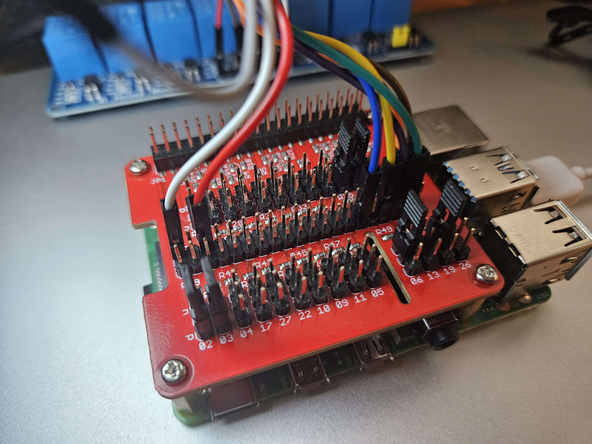
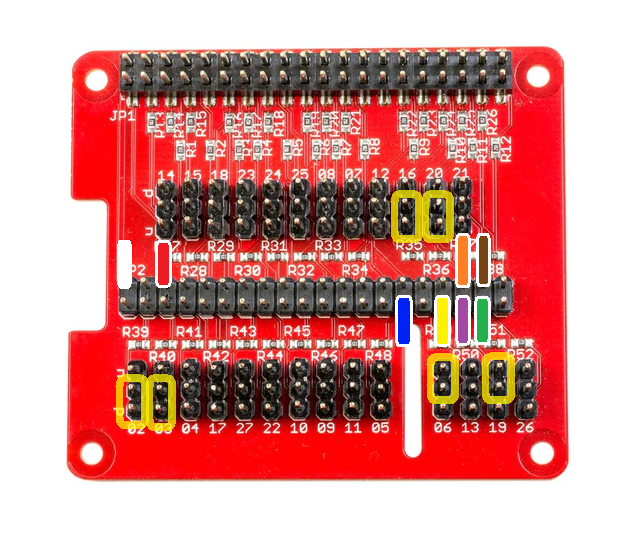
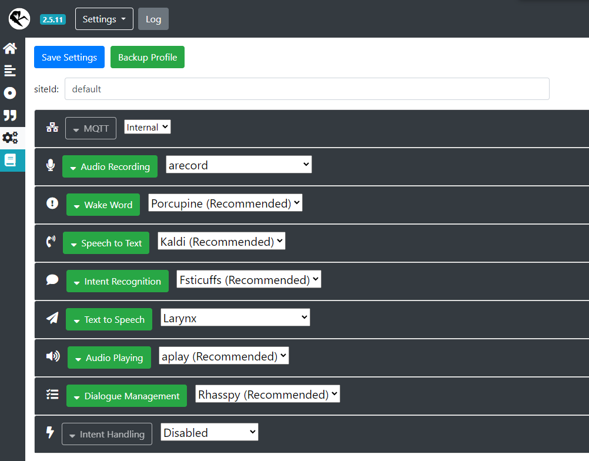
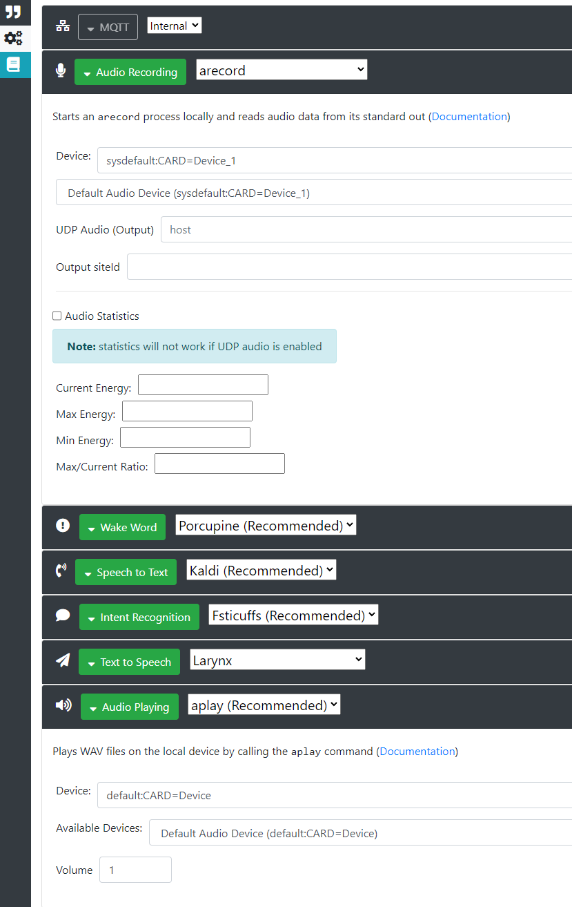
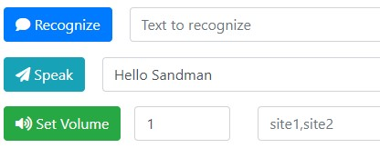
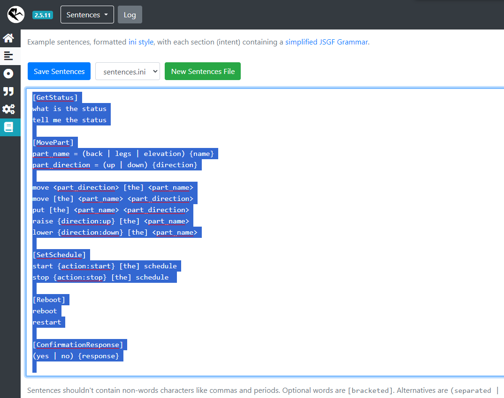
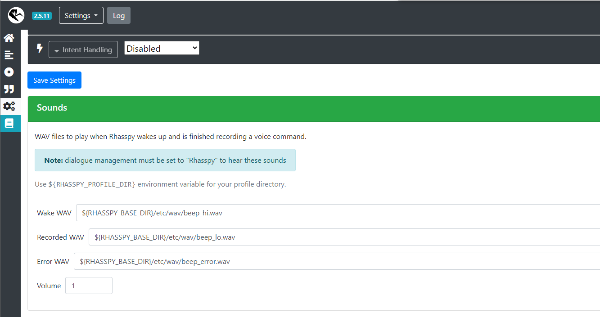
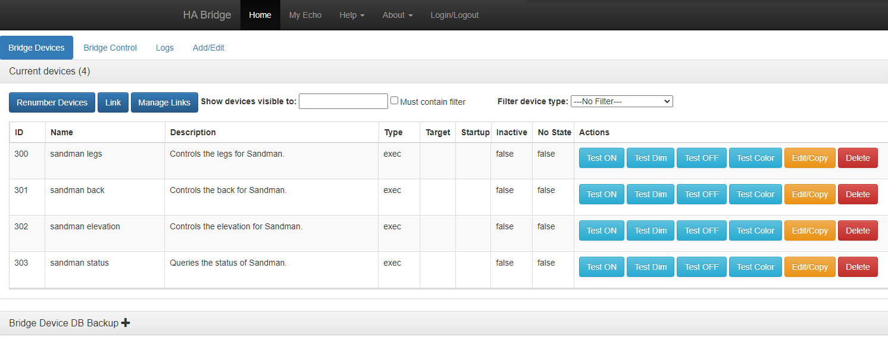
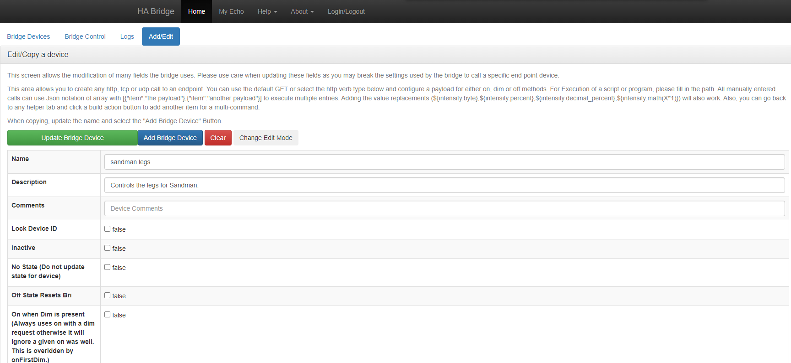
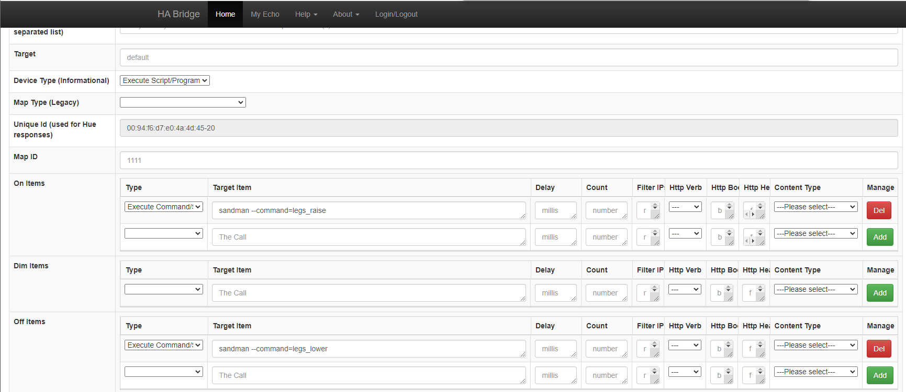

# Sandman

Sandman is a device that is intended to assist people, particularly those with disabilities, in using hospital style beds. Therefore, it is not just software, but a combination of both software and hardware. The software is primarily designed to enable controlling a bed by voice. However, work is also underway on providing analytics of usage through a web interface. Currently the software is intended to be run on a Raspberry Pi, and is primarily developed on a Raspberry Pi 4. 

Sandman has a Discord server to support our community. You can join it here: [Sandman Discord](https://discord.gg/XBYtSAXK2B)

Sandman also has a YouTube channel: [Sandman YouTube](https://www.youtube.com/@project-sandman)

## Disclaimer

The current methods of using Sandman to control a bed involve either modifying the electronics of the bed hand control or electrically interfacing with the bed through its controller connector. It is possible that either one of these techniques may void the warranty on the bed. If you choose to do this, you do so at your own risk. We hope that in the future we will be able to develop another technique that avoids these issues.

## Hardware Setup

Although there is more than one way for the Sandman software to control a bed, this explanation will focus on just one. The control flow is illustrated below.

Sandman > Raspberry Pi GPIO > Pull Up/Down HAT > Relays > Bed Hand Control

It should be noted that if the hand control is modified in such a way that the cover remains intact and can be put back on, the addition of Sandman will not prevent the hand control from being used as it was originally. We have been running Sandman on a Raspberry Pi 4B with 2 GB of RAM. We typically use at least 32 GB SD cards, but this may not be strictly necessary because we need more memory for development purposes. 

### GPIO

Sandman assigns a specific GPIO to each bed function. This is configurable, but by default has the following mapping:

| Function | Pin |
| --- | --- |
| Back Up | 20 |
| Back Down | 16 |
| Legs Up | 13 |
| Legs Down | 26 |
| Elevation Up | 5 |
| Elevation Down | 19 |

### Pull Up/Down HAT

Especially when booting, the state of the GPIO pins can fluctuate and to mitigate this we have been using pull up and pull down resistor pairs. We typically use a 
[ModMyPi PUD HAT](https://thepihut.com/blogs/raspberry-pi-tutorials/how-to-use-modmypis-pud-hat) for this purpose because it's convenient, but if you prefer to make your own circuit board that should work as well. Here is a picture showing how we have set up our PUD hat:



Here is a diagram indicating the configuration:



The rainbow colored markers go to the relay board.

### Relays

In order to support the six bed functions, at least six relays are required. However, it's pretty common to find eight relay boards. In actuality, a relay is overkill for what we intend to do, which is close a circuit on the intended button of the bed hand control. A Darlington pair transistor can replace each relay and accomplish the same job. It would also take less space. However, for convenience we have just been using an eight relay board. The specific wiring is up to you, as long as you are lining up the correct bed function with the relay corresponding to the same button on the hand control.

### Hand Control

You can solder wires from each relay directly to the pads of each hand control button, but we like using a cable like this 
[DIN-12 Male-Female Cable](https://www.digikey.com/en/products/detail/amphenol-ltw/M12A12ML-12AFL-SB002/9932279) instead. The cable can be cut in half and then one half can be connected to the relays and the other soldered into the hand control. This makes it much easier to disconnect and reconnect if needed and since the cable assembly we have been using can screw together it can be very secure. By modifying the hand control in this way, we are essentially simulating button presses and controlling the bed through the hand control. This has the advantage that it works with controllers that have more complicated logic built in, but is not necessary for all types of beds.

## Software Installation

### Rhasspy

Sandman relies on [Rhasspy](https://rhasspy.readthedocs.io) to provide voice control and auditory feedback. Follow these [instructions](https://rhasspy.readthedocs.io/en/latest/installation/) in order to install Rhasspy. However, use the following command to start the Docker image rather than the one in the instructions, because we need to expose an additional port.

```bash
docker run -d -p 12101:12101 -p 12183:12183 \
      --name rhasspy \
      --restart unless-stopped \
      -v "$HOME/.config/rhasspy/profiles:/profiles" \
      -v "/etc/localtime:/etc/localtime:ro" \
      --device /dev/snd:/dev/snd \
      rhasspy/rhasspy \
      --user-profiles /profiles \
      --profile en
```

Once Rhasspy is running, it can be configured through its web interface by going to YOUR_SANDMAN_IP_ADDRESS:12101. 

#### Settings

If you click on the icon which looks like a set of gears, you should see an interface that looks something like the following, although the settings may be different:



It is recommended that you set all of the settings to the same thing as pictured above, but you may use whichever text to speech option you like. You can also choose whichever wake word you prefer under Wake Word. When you're done, click on the Save Settings button. Please note that you may have to do this iteratively, and you may be asked to download data for some of the settings. A download button should appear at the top of the page like below if additional data is needed.


You will also have to fill out the device information underneath the Audio Recording and Audio Playing settings. Click the green colored area with the caret to the left to expose the microphone/Audio Recording or speaker/Audio Playing settings. Once expanded you will want to click the refresh button on the right side of the page then you'll need to select the correct available device for the microphone and speaker from the dropdown. For instance the audio recording device might be "Default Audio Device (sysdefault:CARD=Device_1)" and the audio playing device might be "Default Audio Device (sysdefault:CARD=Device)". It might be helpful to plug in one device at a time, refresh the device list, then review which device(s) have been added to the list. The device list may be long so this may take some trial and error while testing as described below.



You can test the audio recording and playback on home page for Rhasspy aka the house button on the left navigation bar. On the home page put some test text into the text field next to the Speak button and then press the Speak button to test the speaker. If this doesn't produce any sound or if an except/error pops up return to the previous settings page and try selecting a different playback device until successful. You may also want to adjust the volume at this point. 1 is the max volume. With the speaker working click the yellow Wake Up button on the home page then speak into the microphone. Now you can click the green Play Recording button to hear what was captured by the microphone. If the microphone isn't working then you likely will see a message in red saying "No intent recognized" appear after the "Listening for command" popup closes. You'll need to select a different device under the Audio Recording setting and repeat the test.



#### Sentences

Sentences are the grammar which dictates the conversations you can have. If you click the sideways looking bar graph icon, you will see the following interface, although the highlighted text may be different.



No need to type all of this out! You can copy the sentences from [here](rhasspy/sandman_rhasspy_sentences.txt) and replace the default sentences. Then you will need to click the button that says Save Sentences. This should cause the grammar to be generated.

#### Wake Sounds

If you would like to change the wake sounds, you can use the provided sounds or use your own by first copying them into the configuration location like this:

```bash
sudo mkdir ~/.config/rhasspy/profiles/en/wav
```
```bash
sudo cp ~/sandman/rhasspy/wav/* ~/.config/rhasspy/profiles/en/wav/
```

You can find the sound setting by clicking on the icon that looks like a set of gears and scrolling down. It looks like the following image:



Then you can replace each path with the following:

```bash
${RHASSPY_PROFILE_DIR}/wav/beep-up.wav
${RHASSPY_PROFILE_DIR}/wav/beep-down.wav
${RHASSPY_PROFILE_DIR}/wav/beep-error.wav
```

Click Save Settings and it should start using the new sounds.

### Sandman

Currently, building Sandman from source requires the following libraries:

```bash
sudo apt install bison autoconf automake libtool libncurses-dev libxml2-dev libmosquitto-dev -y
```

You can download and extract the source or clone the repository using a command like this:

```bash
git clone https://github.com/shawn-lindberg/sandman.git
```

Then, it can be built and installed with the following commands:

```bash
cd sandman/sandman
```
```bash
autoreconf --install
``````
```bash
./configure
``````
```bash
make
sudo make install
```

### Web interface with Flask

Sandman has a web interface implemented with Flask. These instructions cover what you need to do in order to run this web interface in development mode. In the future there will be a way to run this web interface in a more production friendly environment.

Installation instructions can be found here: [Flask Installation](https://flask.palletsprojects.com/en/3.0.x/installation/). However, they are not complicated and we can skip a step, so they will be provided here. Assuming that your Sandman repository is stored in the home directory, it is recommended to switch to the Sandman web directory in order to set up the virtual Python environment. This is not strictly required, but is recommended by Flask.

```bash
cd ~/sandman/sandman_web
```
```bash
python3 -m venv .venv
```

Once the virtual environment is made, you will activate it with the following command. This must be done in this directory every time you want to start up the web server.

```bash
. .venv/bin/activate
```

Then you can install Flask in the virtual environment with pip.

```bash
pip install Flask
```

To run the web server in development mode use the following command. This must be done after activating the virtual environment with the command given earlier.

```bash
flask --app sandman_web run --debug --host 0.0.0.0
```

Then in your web browser enter the following URL: YOUR_SANDMAN_IP_ADDRESS:5000/reports. Currently you must provide the report suffix, because index redirection is not working at the moment.

### ha-bridge

Although the speech recognition provided by Rhasspy is a decent offline option, you may want to use Sandman with Alexa enabled devices. Although there is no direct integration at the moment, you can use [ha-bridge](https://github.com/bwssytems/ha-bridge) as a way of controlling a bed as though it is a series of light switches.

Once you have set up ha-bridge, you can add devices through its web interface by going to YOUR_SANDMAN_IP_ADDRESS. If you go to Bridge Devices, you should see an interface something like the following:



When you edit/copy a device, the first important thing is the name. This is the name that you will have to use to refer to the device with Alexa.



The next picture demonstrates how to set up the device so that telling it to turn on will move a part of the bed in one direction, and telling it to turn off will move it in the other direction.



You can test the devices from the device page, and once you have set them all up you can go through the discovery process.

## Usage

Once you have built and installed Sandman, you can execute it from the command line like this, which will start it in interactive mode:

```bash
sudo /usr/local/bin/sandman
```

To exit this mode, simply type quit followed by pressing the enter key. This is primarily used for testing/debugging.

To run it as a daemon instead, use the following command:

```bash
sudo /usr/local/bin/sandman --daemon
```

The following commands are examples of how you can send commands to Sandman running as a daemon:

```bash
sudo /usr/local/bin/sandman --command=back_raise
sudo /usr/local/bin/sandman --command=back_lower
sudo /usr/local/bin/sandman --command=legs_raise
sudo /usr/local/bin/sandman --command=legs_lower
sudo /usr/local/bin/sandman --command=elevation_raise
sudo /usr/local/bin/sandman --command=elevation_lower
```

You can stop Sandman running as a daemon with:

```bash
sudo /usr/local/bin/sandman --shutdown
```

### Running on boot

If you would like to run Sandman at boot, an init script is provided. You can start using it with the following commands:

```bash
sudo cp ~/sandman/sandman.sh /etc/init.d/
```
```bash
sudo chmod +x /etc/init.d/sandman.sh
```
```bash
sudo update-rc.d sandman.sh defaults
```

## Roadmap

### Software

* Convert the schedule to JSON.
* Implement a web interface for modifying the schedule.
* Implement a web interface for modifying the configuration.
* Add control over whether notifications are played.
* Simplify setup - Docker?
* Switch to systemd?

## Contributing

Sandman was in development privately for many years before going public. If you would like to get involved, please join the [Sandman Discord](https://discord.gg/XBYtSAXK2B).

## License

[MIT](https://choosealicense.com/licenses/mit/)
